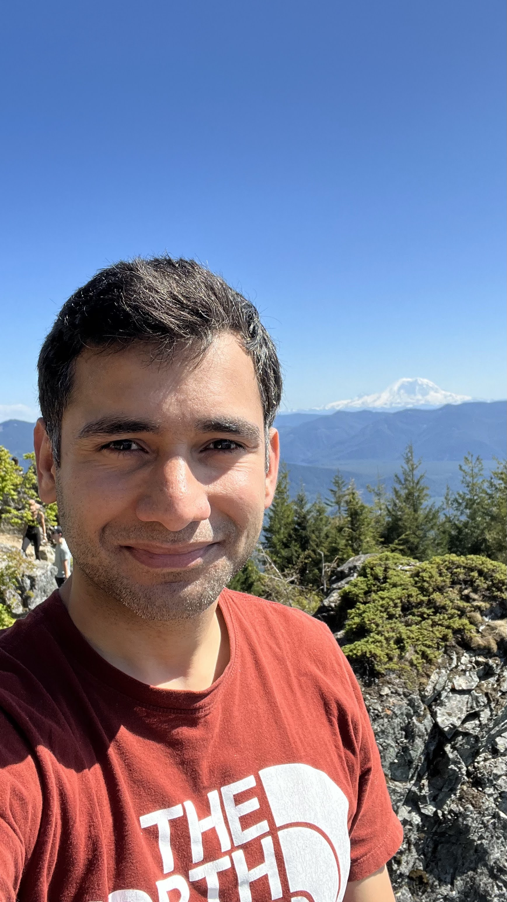

I live in San Francisco and build AI agents at work.

### Autonomous Agents

I work on autonomous bug fixing agents. Our goal is build a product that can fix most software bugs on it's own. It's like you've got this really smart co-worker that works when you sleep. Production systems have tons of issues some are priority, most are not. Our system works on them and regularly sends pull requests for engineers to review. 

### Health AI

I think health is one of the most important applications of AI. It has the potential to improve health care systems and boost productivity.

*Diagnosis*

The complexity of human bodies make medical diagnosis incredibly challenging. Medicine has fundamentally been about pattern recognition. If you have symptom X, Y, Z then you might have disease A. AI can do this pattern matching well. 

* We built *AMIE*, a diagnosis system and measured performance of LLMs on complex medical cases from NEJM. Published the results in [Towards accurate differential diagnosis with large language models](https://www.nature.com/articles/s41586-025-08869-4). [Google blog post](https://research.google/blog/amie-a-research-ai-system-for-diagnostic-medical-reasoning-and-conversations/)

* We gave *AMIE* vision so that it can see and understand lab reports, ECGs, X-rays and photos of conditions. Published our findings in [Advancing Conversational Diagnostic AI with Multimodal Reasoning](https://arxiv.org/abs/2505.04653). [Google blog post](https://research.google/blog/amie-gains-vision-a-research-ai-agent-for-multi-modal-diagnostic-dialogue/)

* Oversight is the prerequisite anything in Health so we created a framework for Scalable Oversights for *AMIE* called *Guardrailed AMIE or g-AMIE* and demonstrated that AI can augment our existing medical systems and improve care. Published our findings in [Towards physician-centered oversight of conversational diagnostic AI](https://arxiv.org/abs/2507.15743). [Google blog post](https://research.google/blog/enabling-physician-centered-oversight-for-amie/)

### Side projects

* I wanted all the substacks and blogs that I follow to be at one place and have an AI to know what my interests and feature only the ones that I would want to read. The AI part is unfinished but the newsletter is [here](https://yasharma.com/posts/).  
* I vibe-coded an [iOS app](https://github.com/yashrmaa/noisemeter) that measures noise and tells me it's impact on my health.

## Podcast

* I was a guest on [Cillers Hackathon podcast](https://open.spotify.com/episode/1BJHEsJ04xMgAPliO8awSa?si=6ddfa595649449bb) where we talked about AI and my journey from a small town in India to AI agents in San Francisco.

## Writing

Interesting pieces:

**[Rainier](/posts/rainier/)** - I thought people like me don't climb mountains. I was wrong.  
**[Peru](/posts/peru/)** - Went on a whim and met people who'd sold everything to travel. Made me question what I'm really chasing.  
**[The Harsh Realities of Legal Immigration](/posts/the-harsh-realities-of-legal-immigration/)** - 9 years in America, still can't call it home. The system is broken.  
**[Cities](/posts/cities)**  - Seattle taught me to climb mountains. NYC taught me to never stop moving. Places shape us more than we realize.  
**[Istanbul](/posts/istanbul)** - Couldn't sleep at 3 AM so I found the most alive street I've ever seen.  

[→ All writing](/posts/)

## Currently

Experimenting with fruit-till-noon eating, rethinking decision-making frameworks, and living more in the moment. Always planning the next adventure.

---

*Questions? Ideas? [Get in touch](mailto:yash@yasharma.com)*