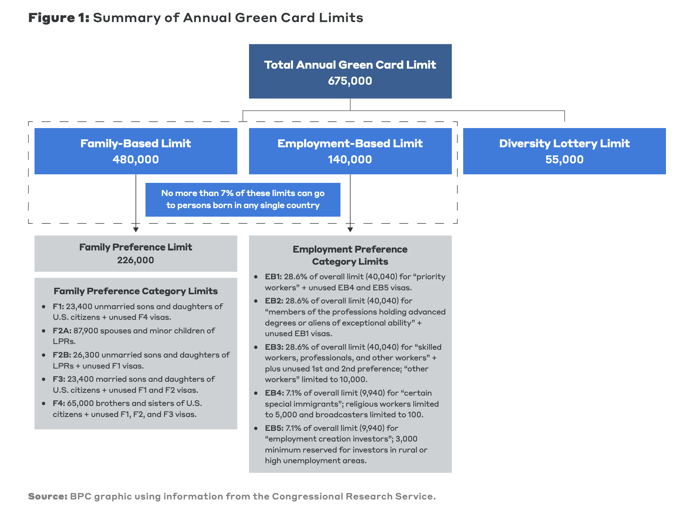

**The [essay](https://www.readtangle.com/otherposts/the-harsh-realities-of-legal-immigration/) was published on [Tangle](https://www.readtangle.com/)**.

Regardless of their politics, everyone has a view on immigration. More often than not, people [support legal immigration over illegal immigration](https://news.gallup.com/poll/508520/americans-value-immigration-concerns.aspx). Both sides also generally agree that highly skilled immigrants are a valuable asset to the U.S. economy. I would even say most people who immigrate illegally would want to do so legally. But obscure and dated laws in the U.S. make legal immigration downright painful. 

I am a legal immigrant from India on the H-1B visa. I work in technology and have lived in the U.S. for 8 years now. I am considered a highly skilled immigrant, and despite a recent statement from Trump [perferring immigrants with college degrees](https://www.cnn.com/2024/06/20/politics/trump-green-cards-gradutate-college/index.html) and an executive order from Biden [prioritizing tech workers](https://www.whitehouse.gov/briefing-room/statements-releases/2023/10/30/fact-sheet-president-biden-issues-executive-order-on-safe-secure-and-trustworthy-artificial-intelligence/), I have no realistic path for permanent residence (green card) and citizenship.  

There are [multiple pathways](https://www.uscis.gov/green-card/green-card-eligibility-categories) for getting a green card: employment, family, stateside investment, etc. I fall into the employment category. Most categories have a fixed ceiling as well as quotas for recipients based on their country of birth. U.S. law provides 140,000 employment based green cards per year and no more than 7% of that number can come from any one country. 

As you can imagine, this system disproportionately impacts India, as it doesn't take into account the country's population. India is also the world’s most populous country and has an ascendant tech sector with a large number of tech workers in the green card queue. Right now, there are more than [1.2 million](https://www.forbes.com/sites/stuartanderson/2024/04/14/more-than-1-million-indians-waiting-for-high-skilled-immigrant-visas/) Indians waiting in line for a green card, which they'll have to wait around [150 years](https://www.cato.org/blog/150-year-wait-indian-immigrants-advanced-degrees) for. 

As a result, many Indian tech workers stay in the U.S. on H-1B visas, which are temporary and were designed to address specific short-term business needs. H1-Bs are limited to a maximum of [six years](https://www.boundless.com/blog/h-1b-visa-six-year-limit/); that means you can get it renewed many times, but not past six years. The authorities know about it, so they created [provisions to extend it indefinitely](https://www.visapro.com/resources/article/h1b-extension-beyond-6-years/) for those in the green card line. For workers  from India, this basically means we will be on this visa forever and thus bound by its strict criteria and bureaucracy.

The H-1B visa literally ties your life to your job. You can't change roles or employers without facing a long and expensive bureaucratic process for a transfer. I have done it twice, and it has cost me about [$6000](https://internationaloffice.berkeley.edu/ucb_departments/h-1b/fees) and 3 months of work. Not many employers can afford to pay those fees, so there are fewer jobs that sponsor visas. This limits career growth as smaller companies and startups usually don't hire folks on visas. 

Every couple of years, I have to go through the visa-renewal process that is intentionally designed to help employers while disregarding individuals. Employers file the paperwork that gets everything except the visa stamp on the passport that admits you into the country. Every renewal, I have to go to India to get the visa issued. The process takes about a month where I personally have to travel to the US consulate in a different city. The need for a visa takes away the freedom of travel. Every time I think about visiting my family, I have to meticulously plan around the intrusive visa appointment.

I am by no means unique — Indians face this precarious situation all the time. There are [many instances](https://www.thebulwark.com/p/visiting-family-abroad-has-become-a-glitchy-government-nightmare-for-immigrants) of people not being able to visit their families outside the US. I read [gut-wrenching posts of people](https://twitter.com/sumzzzie/status/1490501001001910273) forced to choose between maintaining their life here or [attending a parent's funeral](https://twitter.com/PareenMhatre/status/1489983841821507585). It feels immoral to imagine an immigration system that creates such a choice. But sadly, that's our reality. 

Living on a visa pauses your life where you don't feel secure. I can't call the U.S. home even after eight years because if I lose my job I will have 60 days to find another one or leave. In the last couple of years, many of my friends have found themselves in this difficult situation. We all live in fear. You can't buy a house or settle down when your residency is held by a thin string. Even worse, for residents on recurring H1-B visas with families, if something unfortunate were to happen to the principal visa beneficiary, the entire family would have to leave the country immediately. That could mean uprooting an entire household at the apex of their grief.

Then there's the impossible choice that [documented Dreamers](https://www.americanimmigrationcouncil.org/research/documented-dreamers-overview) (children of long-term visa holders) face when they reach 21\. These individuals have lived in the U.S. all their lives, but they are forced to self-deport when they age out of the dependent visa status. They don't get any protection from the law and are excluded from DACA and other such programs. It seems the only mistake their parents made was to follow the law. 

The U.S. Constitution grants all people equal rights, but the legal system discriminates against people based on the country of birth. If an employer can't discriminate based on country of birth, why does legal status depend on it? The very quota system that hamstrings Indian workers is no accident, but a direct result of discrimination. Such discriminatory policies are [rooted in racist ideologies](https://www.cato.org/blog/lets-stop-discriminating-against-immigrants-populous-nations) that preferred "white" immigrants over others. The way to enforce it was to create a quota for each country.

However, even after 100 years of societal progress, the discriminatory policies remain. In its effort to alleviate immigration pains, the Biden administration made laws that are disheartening to anyone following the law, particularly a policy to give [work permits](https://www.nytimes.com/2024/04/15/us/migrants-work-permits-undocumented.html) to undocumented migrants. I can’t help but shake my head in disbelief that people on visas get 1-3 years of work permits that’s tied to the employer whereas crossing the border illegally gets you a [work permit](https://www.nytimes.com/2024/04/15/us/migrants-work-permits-undocumented.html) with no strings attached. [This](https://x.com/FrescoLeon/status/1802518063163527488) thread sums up my feelings perfectly.

The extremely restrictive immigration system not only harms human wellbeing, but it’s also holding back the U.S. economy. In 2023, Bipartisan Policy Center published a [report](https://bipartisanpolicy.org/download/?file=/wp-content/uploads/2023/11/WEB_BPC_Immigration-Green-Light-to-Growth_R01.pdf) on the economic benefits of clearing the backlog, estimating that clearing the employment-based backlog alone would increase the U.S. GDP by $250 billion over 10 years. Clearing the entire backlog over the same span would be worth $3.9 trillion. 

[Harvard Business Review](https://hbr.org/2021/08/research-why-immigrants-are-more-likely-to-become-entrepreneurs?trk=article-ssr-frontend-pulse_little-text-block) found that immigrants are more likely to start a company. [Another study](https://nfap.com/wp-content/uploads/2016/03/Immigrants-and-Billion-Dollar-Startups.NFAP-Policy-Brief.March-2016.pdf) found that 51% of all billion-dollar startups were founded by immigrants, and a breakdown of their findings shows that [23%](https://nfap.com/wp-content/uploads/2016/03/Immigrants-and-Billion-Dollar-Startups.NFAP-Policy-Brief.March-2016.pdf) (14 out of 60\) were founded by Indians. This is a huge economic cost of the green card backlog: the 1.2 million Indians in the backlog can’t start a company. [Another study](https://insight.kellogg.northwestern.edu/article/immigrants-to-the-u-s-create-more-jobs-than-they-take) from Northwestern’s Kellogg School of Business looked at the impact of entrepreneurship on job creation and found that “ironically, the result is exactly the opposite of the usual narrative. It seems like immigrants actually improve the economic outcomes for native-born workers.”

There hasn’t been a study that talks about how many of the backlogged folks would become entrepreneurs if they were free to do so. But it’s not hard to see that it would be a large percentage. I am basing the assumption on the fact that I, and many of my friends and peers would do that if we had the freedom.

For non-employment categories, the situation is not any better — no matter who has been president. The Republicans and Democrats oscillate between punishing all immigrants and punishing only those who follow the law. The Trump administration brought the entire immigration system to a halt. Rather than solving pain points, they [deliberately created more obstacles for legal immigrants](https://www.forbes.com/sites/stuartanderson/2024/01/17/bad-news-for-employers-immigrants-and-h-1b-visas-in-second-trump-term/?sh=750cfc9f3583). 

With Democrats, the Indian community hoped that the discriminatory laws and policies would be fixed, but we got even more disappointing policies. Biden recently issued an [order](https://www.bbc.com/news/articles/c4nnyr4j9w5o) that gives legal pathway to undocumented spouses of U.S. citizens. I am glad that it’s helping people, but for someone who followed the law in coming to this country and faces the uncertainty and immense bureaucracy of U.S. immigration, the exclusion of those of us in H1-B limbo feels like a slap in the face.

Customs and Immigration (USCIS) had a backlog of about [4.3 million cases](https://www.uscis.gov/EOY2023) at the end of 2023, and this number keeps on increasing. The administration did nothing to improve the backlog while handing them a million plus cases. This would impact everyone dealing with USCIS. 

The current wait time for [I-601](https://www.uscis.gov/i-601), which is the current application for undocumented spouses, is [26 months](https://x.com/FrescoLeon/status/1803034709720535152). It essentially means that immigrating the right way takes about 3 years. So it’s not hard to see why folks decide to not follow the law: it’s the government that’s letting everybody down.

This system impacts Indians and other legal immigrants in a much deeper way. Apart from slowing everything down, it essentially takes away green cards from people in line. Now that more green card applications would come in and the allotment is based on country of birth, huge swaths of people would cut in line and worsen the misery of the backlogged community based on the whims of USCIS. The most negatively impacted would be applicants in the [family-based category](https://www.uscis.gov/green-card/green-card-processes-and-procedures/visa-availability-priority-dates/when-to-file-your-adjustment-of-status-application-for-family-sponsored-or-employment-based-103), mainly people from China, India, Mexico, and the Philippines.

Another tragic impact of bogging down the system is the loss of these precious green cards, which have strict deadlines. If they aren’t issued in time, they are wasted. In the system, where people are waiting for decades, wasting these cards is just plain cruel. But this happens more often than we would hope. In 2021, USCIS wasted [230,000 green cards](https://www.boundless.com/blog/uscis-wastes-200k-green-cards-backlog-triples/) because they were unable to process the petitions in time. Every lost green card is not just a loss for that applicant, but a loss of freedom for the individual who could have obtained it. 

I can’t underscore enough that there’s a human behind each visa, each green card petition. I wish everyone could see it that way and understand that we don’t choose our places of birth, but we do choose the places where we build our lives. The U.S. is the only place in the world that truly values talent and hard work. It rewards you with immense opportunities, irrespective of where you come from. 

I hope someday I can have the privilege of calling this place home.
